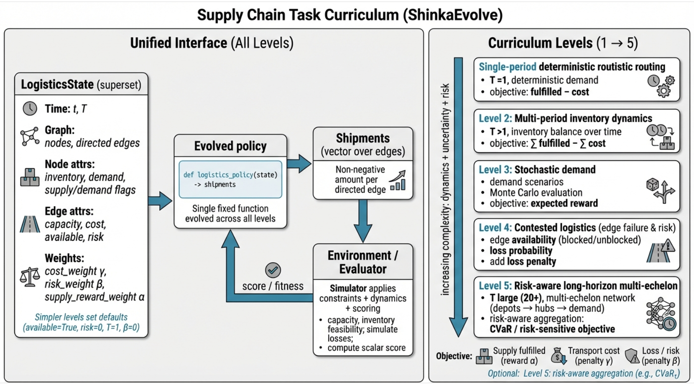

> [!IMPORTANT]
> 本稿の要点は[本質](#本質)にまとめています。

## はじめに

これは論文を書き慣れていない研究者向けのTips記事です。

論文執筆が佳境に入ると、Fig.1の設計が大きな課題になります。Fig.1は研究の要旨を端的に伝える重要な要素であり、短い締切の中で質の高い図を仕上げるのは容易ではありません。PowerPointで試行錯誤しているうちに時間だけが過ぎ、初稿を整える前に別の作業が山積みになることも多いでしょう。

近年は生成系ツールの精度が大幅に向上しており、初期案のドラフトをAIに作成してもらうことで、議論とブラッシュアップに専念する方が効率的です。本稿ではNano Banana Proを活用し、Fig.1のドラフトを迅速に用意する手順と注意点をまとめます。

## Nano Banana ProでFig.1のドラフトを作成する

### 手順

以下の手順で画像を生成します。

1. タスクや論文の主眼を文章化します。草稿段階でも構いませんが、要点が伝わる程度には丁寧にまとめておきます。
2. `ChatGPT5.2-Thinking` に次のプロンプトを入力し、デザイン用プロンプトを生成します。
3. [Google AI Studio](https://aistudio.google.com/app/prompts/new_chat) で Nano Banana Pro（models/gemini-3-pro-image-preview）に出力されたデザインプロンプトを入力します。
4. 生成された画像を取得し、議論や資料作成に活用します。

```plaintext
For my research paper, I would like to propose the following task. 
To clearly visualize the task overview in Figure 1, 
I need you to create an English design prompt that can be fed into a model for automatic generation.
{{description}}
```

`{{description}}` の部分に、手順1でまとめたタスクや研究の要点を記載する。

### Fig.1ドラフトの例（研究アイデア共有）

以下は、対話的動画検索タスクの共有を目的として作成した例です。タスク設定が複雑なため、文章や数式だけでは伝わりにくい部分を図示し、共同研究者との議論に活用しました。実際にPIクラスの研究者2名と助教1名に提示したところ、議論がスムーズになり好評でした。Google Slidesに生成画像を貼り付け、付箋でコメントを残しながら検討を進めると、論点を整理しやすくなります。

### 使用例｜込み入った定義を可視化して提示する

たとえば、ShinkaEvolveフレームワークで貨物輸送の最適化タスクを実装した際、口頭説明だけでは理解を得るまでに時間がかかりました。タスクの詳細は [タスクのREADME.md](https://github.com/Silviase/ShinkaEvolve/tree/supply_chain/examples/supply_chain) に記載していますが、同じ内容を図として提示すると、議論の前提を短時間で共有できました。以下はREADMEの内容をそのままChatGPTに入力し、Nano Banana Proで生成した図です。



図を補足しながら説明することで、輸送の流れを可視化したGIFなどを組み合わせる際にも理解が得られやすくなります。

### Tips｜留意点

利点だけでなく、次のような制約も認識しておきたいところです。

* **具体的な事例を含むFig.1は自動生成が難しい**  
  例示が必要な場合は、別途自分で素材を用意するなどの工夫が求められます。
* **生成品質はあくまでドラフトレベル**  
  練り上げたFig.1より情報量や精緻さで劣ることが多いです。出力を参考に、最終図を整える前提で活用してください。
* **内容に誤りが混入する可能性がある**  
  ChatGPTとGeminiを経由するため、まとめの段階で誤りが入り込む場合があります。必ず人手で検証してください。

## 本質

> [!IMPORTANT]
> Nano Banana Pro（models/gemini-3-pro-image-preview）で、Fig.1の初稿候補を迅速に得られる。  
> 構造化の質はChatGPTの出力に依存するが、概略を整理する用途には有用。ただし誤りには注意が必要。  
> Fig.1だけでなく、研究初期段階のアイデア共有にも効果的。  
> 2025年12月時点ではNano Banana Proの利用にPaid APIが必要だが、1枚あたり約23円で生成でき、費用対効果は高い。
