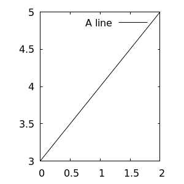

# Rustで最適化ことはじめ 第0回

<script async src="https://cdnjs.cloudflare.com/ajax/libs/mathjax/2.7.0/MathJax.js?config=TeX-AMS_CHTML"></script>
<script type="text/x-mathjax-config">
     MathJax.Hub.Config({
     tex2jax: {
     inlineMath: [["\\(","\\)"] ],
     displayMath: [ ['$$','$$'], ["\\[","\\]"] ]
     }
     });
</script>

## やりたいこと

以下のような式を最適化することを目指します.
$$ \text{maximize} \sum_{i=0}^n S_ix_i \quad \text{s.t.} \bf{Ax} \leqq \bf{b} $$

ここでは一般的にベクトルは列ベクトルで表すことにします.
さて, この線形計画法は実行可能領域は凸多面体になり, 実行可能領域の境界に現れることになります. 仮に**実行可能領域が存在しない場合**や**境界が目的関数の向きに存在しない場合**は最大となるようなベクトルxを得ることが出来ません.

したがってここでは実行可能領域は存在し, 最大値を得ることができるとわかっている性質の良いものについてのみ最適化を考えます.

## 第0回: Rustで最適化…その前に

### ndarrayの導入

Rustにおいて, 行列を扱う際には```ndarray```というクレートを導入します.このとき,

```bash
cargo add ndarray
```

でndarrayクレートが導入され, 利用しているワークスペースのCargo.tomlに以下のような記述が追加されます.

```toml
[dependencies]
ndarray = "0.13.1"(versionは異なります, 2020/09/10現在)
```

### 初期化と基本的な演算

```main.rs``` において, 行列は```arr2(&[[], [],,,[]])```と要素を直打ちすることで初期化することが出来ます.
また, 和・差・行列積なども計算することが出来, かつ関数の引数に取ることも出来ます.

```Rust
use ndarray::prelude::*;

fn ret(mat: &mut Array2<i64>) -> Array2<i64> {
    let res = mat.clone();
    res
}

fn main() {
    let mut m = arr2(&[[1, 2], [3, 4]]);
    let n = arr2(&[[1, 0], [0, 1]]);

    println!("{:?}", &m + &n);
    println!("{:?}", &m - &n);
    println!("{:?}", &m * &n);
    println!("{:?}", &m.dot(&n));
    println!("{:?}", ret(&mut m));
}
```

### Gnuplotの導入

- まずGnuplotをインストールしましょう. Linuxは```sudo apt install gnuplot```です.
外部クレートをインポートしているから本体には入れなくていいだろうとかそういうわけにもいかず, きっちり本体にもインストールされている必要があります.
- 何かしらグラフを書きたくなった時のために導入しておきましょう.
例によって```cargo add gnuplot```で良いです.

```bash
sudo apt install gnuplot # その後 y
cargo add gnuplot
```

### Gnuplotを使ってみる

以下のようなミニマムなコードで, Gnuplotによってプロットした画像を得ることが出来ます.

```Rust
use gnuplot::{Caption, Color, Figure};

fn main() {
    let x = [0u32, 1, 2];
    let y = [3u32, 4, 5];
    let mut fg = Figure::new();
    fg.axes2d()
        .lines(&x, &y, &[Caption("A line"), Color("black")]);
    let _ = fg.save_to_png("test.png", 300, 300);
}
```

得られた画像は以下の通りです.



さて, これでRustで最適化問題を解く準備が出来ました.
次回から問題を解くことを進めていきましょう.
