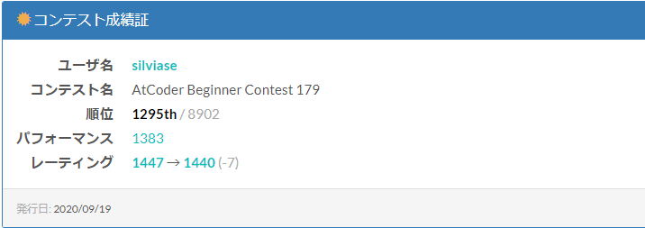

# ABC179に参加しました(参加記)

結果は以下の通りでした.

5か月ぶりにABCに参加することにしたため非常に緊張していました。レートを下げたくないという気持ちから、
パフォーマンスがいい感じに出そうであれば提出しようと思って参加しました.

## 時間経過

### -5分

パフォが水色になりそうなら微減以上にはなるだろうという気持ちがあったので, 軽い気持ちで参加登録をしました.
D,Eが両方簡単ならどちらも, そうでなければどちらかが早いタイミングで出来次第提出をする形を取りました.

### 開始\~10分

A,B,Cを解きました.
文字列操作が出た場合はRustではなくPythonを使うことを事前に決めていました(まだRustでの文字列操作を習得していないため).
ここまでは明らかに簡単な問題であると感じました. Cについては今までのものより捻った考え方をさせるように感じました.

### \~15分

Dを見て5分考えました. DPであることはすぐに理解することが出来ましたが, 
Dに置かれるくらいなら愚直DPだろうと思っていたら計算量が明らかに爆発しそうだと思って実装はしませんでした.
意味ありげな区間の表示と制約の少なさが気になりましたがすぐにはいい解決策が思い浮かびませんでした.
この時点でEが60分以内に解けなければ撤退しようという考えがよぎっていました.

### \~55分

Eを解きました. 実装パワーがないながらも擬似コードはしっかりと書いてから実装すればミスのない実装ができるんだなあということを
実感しました.
 

### \~85分

Dを解きました. ModIntを素手で書いたらバグらせたので二度と間違えません.

## 総括

バグを埋め込まなかった場合に関して考えれば微増, そうでなかったため微減ということなので自分としては
五か月ぶりにしては良い出来だったと感じています. 実はあと160ほどレートを上げることで青になれるというので
意外と遠くはないのではないかと感じているようになっています. 
ただいまだに黄色Perfを取った試しもないのでもっともっと問題を解いていくこと, バグを生み出すことのないように
高速に解くことを意識したいと思います. 水Diffをしっかりと解ききること, また青Diffに挑んで知見を深めることが
できればいいと思います. 
ACLは出ません.

またこの後にABC179の各問題を解説します.