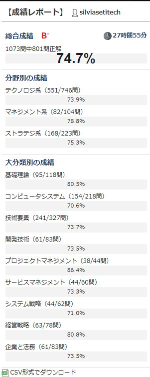
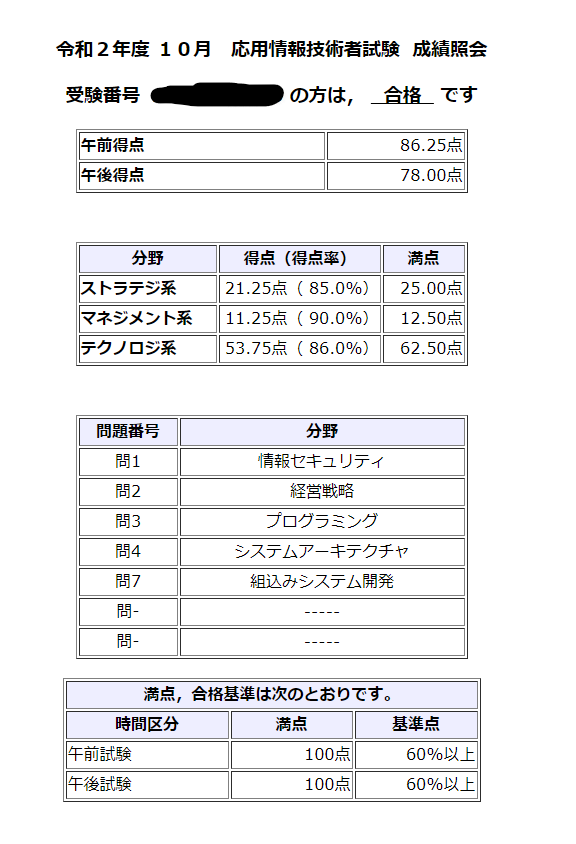

# 応用情報技術者試験に合格しました

年の瀬ですね。しるびあです。この度、応用情報技術者になったので勉強の方法を記して置きたいと思います。
特に参考にすることがあるかと言われると、普通の勉強法なので驚く点はあまりないですが、備忘録として書こうと思います。

## やったこと - 午前

受けたのは令和二年度秋期の応用情報技術者試験です。

基本的に本を丸々読んで覚える、という一連の操作は苦手でした。

したがって、ひたすら問題を解いて答えを覚えるという操作をすることにしました。

ここで役に立つのが[過去問道場](https://www.ap-siken.com/apkakomon.php)です。

応用情報技術者試験は過去問からもそのまま問題が出たりするので、雰囲気で答えを覚えてしまうのもいいかもしれません。

私はほぼ一か月で試験対策を済ませたのですが、だいたいその半分は午前の四択に充てました。

以下の画像が私の記録です。

6割で合格なので、マージンをとって75%くらいあれば十分だろうということでここで打ち切りました。

## やったこと - 午後

まず明らかに実力がない分野を埋める必要があります。
特に、セキュリティの分野に関しては必修なので必ず知識をつける必要があり、ここは優先します。

私はプログラムを普段書いているとはいえ、ネットワークの知識やデータベースの知識は皆無ですから、
その分野を選択することはありませんでした。

そのため、ある程度の論理的な手続きを使いこなせれば回答が容易である
"プログラミング", "システムアーキテクチャ", "組込みシステム"と、
あと一つはその場で簡単だと感じた"経営戦略"としました。

この辺りは柔軟に対応できる所だと思います。
判断基準は記述問題が書けそうかどうか、という点でした。

というのは、大問はおよそ初めの単語記述と、その後の理由回答にわかれていますが、
概ね記述に詰まらなければ点数はとれるだろうという算段です。

## 試験当日について

試験当日は午前はさすがに受かるだろうと思っていたので回答が終わり次第教室から外に出ることにしました。

当日に暗記の最終確認をするというわけではなく、近所のカフェでのんびりするためです。

試験時間いっぱいまで悩んだところでいい結果が得られるわけではなく、
むしろ悩んで変えた点については間違えていることが個人的には多いからです。

午後は記述するにあたって、文章の中からきっちりと根拠となる文章を探すことを心がけました。

## 結果

合格。落ちなくてよかった…

